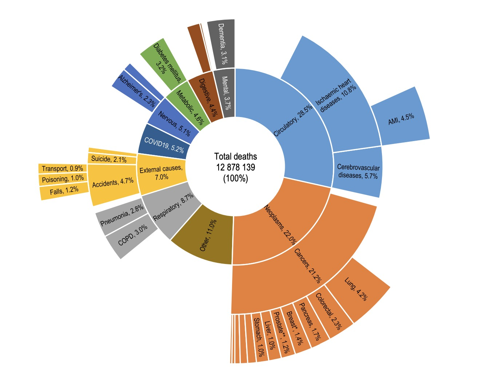
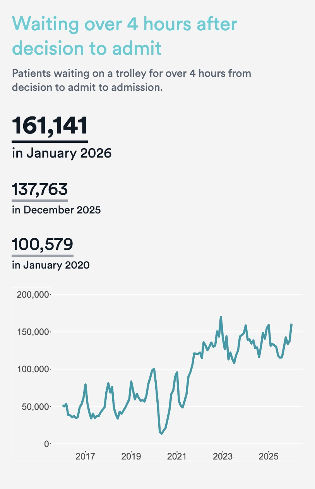

## Definição do Utilizador-Alvo

A dashboard desenvolvida neste projeto destina-se a apoiar diferentes perfis de utilizadores envolvidos na gestão, planeamento e análise do Serviço Nacional de Saúde (SNS). Tendo em conta a natureza dos dados utilizados — despesa hospitalar, produtividade clínica, recursos humanos e pressão assistencial — identificam-se três principais utilizadores-alvo:

### 1. Gestores Hospitalares
Incluem diretores e equipas administrativas responsáveis pela eficiência dos hospitais. Estes utilizadores necessitam de:
- Relacionar despesa operacional com produção clínica.
- Identificar hospitais com potenciais ineficiências financeiras.
- Analisar como os diferentes componentes da despesa evoluem ao longo do tempo.

### 2. Decisores do Ministério da Saúde e das Administrações Regionais de Saúde (ARS)
Atuam ao nível estratégico e de políticas públicas. Para estes utilizadores, a dashboard permite:
- Avaliar se a distribuição de médicos e enfermeiros é proporcional às necessidades regionais.
- Monitorizar tendências de despesa, incluindo o crescimento da dívida.
- Suportar decisões de alocação de recursos com base em evidência.

### 3. Analistas de Dados e Profissionais de Saúde Pública
Responsáveis por análises comparativas e pela produção de relatórios técnicos. Estes utilizadores procuram:
- Explorar padrões nas várias regiões de saúde.
- Identificar outliers em despesa, produtividade ou recursos humanos.
- Comparar indicadores ao longo do tempo e entre unidades hospitalares.

---

## Principais Perguntas Analíticas

A dashboard foi concebida para responder a um conjunto conciso de questões analíticas, alinhadas com as necessidades dos utilizadores-identificados:

1. Os hospitais com maior despesa operacional apresentam efetivamente maior produtividade clínica, ou existem casos de ineficiência financeira?
2. Como evoluiu a composição da despesa hospitalar (e.g., Pessoal, Medicamentos) ao longo dos últimos anos?
3. O aumento da dívida hospitalar está mais associado aos custos com Pessoal ou com Medicamentos?
4. A distribuição de médicos pelas regiões é proporcional ao número de utentes atendidos?
5. A distribuição de enfermeiros reflete adequadamente a pressão assistencial (por exemplo, número de consultas)?
6. Que regiões apresentam desequilíbrios entre os recursos humanos disponíveis e a população servida?
7. Que hospitais ou regiões se destacam como outliers em despesa por utente ou produtividade clínica?
8. Como variam os principais indicadores de despesa, recursos humanos e produção clínica entre regiões e ao longo do tempo?

## Tabela Resumo dos Datasets Utilizados

| Categoria | Dataset | Perguntas que Ajuda a Responder | Utilizadores Beneficiados |
|----------|---------|----------------------------------|----------------------------|
| **Finanças** | agregados-economico-financeiros | Composição da despesa; análise de eficiência financeira | Gestores Hospitalares; Analistas |
| **Finanças** | conta-do-servico-nacional-de-saude | Tendências gerais de despesa e orçamento | Decisores; Analistas |
| **Finanças** | divida-total-vencida-e-pagamentos | Identificação das causas de aumento da dívida | Gestores; Decisores |
| **Finanças** | despesa-com-medicamentos-nos-hospitais-do-sns | Peso dos medicamentos na despesa total; impacto na dívida | Gestores; Analistas |
| **Atividade Hospitalar** | atividade-de-internamento-hospitalar | Produtividade clínica; carga de internamentos | Gestores; Analistas |
| **Atividade Hospitalar** | 01_sica_evolucao-mensal-das-consultas-medicas-hospitalares | Volume de consultas; variações regionais | Analistas; Decisores |
| **Atividade Hospitalar** | intervencoes-cirurgicas | Produtividade cirúrgica e eficiência operacional | Gestores; Analistas |
| **Atividade Hospitalar** | cirurgias-em-ambulatorio | Capacidade cirúrgica e produtividade não‑internada | Gestores; Analistas |
| **Recursos Humanos** | trabalhadores-por-grupo-profissional | Distribuição de médicos e enfermeiros; relação recursos/população | Decisores; Analistas |
| **Recursos Humanos** | trabalhadores-por-modalidade-de-vinculacao | Estabilidade laboral e capacidade operacional | Decisores; Gestores |
| **Pressão Assistencial** | utentes-inscritos-em-cuidados-de-saude-primarios | Pressão populacional por região | Decisores; Analistas |
| **Pressão Assistencial** | acesso-de-consultas-medicas-pela-populacao-inscrita | Procura efetiva de cuidados; comparação com recursos | Decisores; Analistas |
| **Pressão Assistencial** | atendimentos-por-tipo-de-urgencia-hospitalar | Pressão sobre urgências; necessidades regionais | Gestores; Decisores 

### OECD Health at a Glance
https://www.oecd.org/en/publications/health-at-a-glance-2025_8f9e3f98-en.html

### NHS
https://www.nuffieldtrust.org.uk/qualitywatch/nhs-performance-dashboard

https://www.nuffieldtrust.org.uk/qualitywatch/analysis